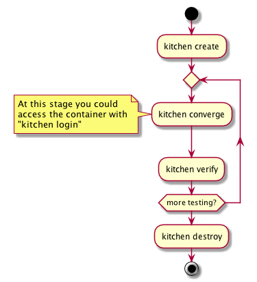

# Ansible Sandbox

## Introduction

This repository is intended to be a introduction to using kitchen test and
Docker to test Ansible code.

For these steps to work on your local machine, you will need to have
[Docker installed](https://docs.docker.com/engine/installation/).

## Tests and TravisCI

### Testing Lifecycle

| Command           | Description |
|-------------------|-------------|
|`kitchen create`   | Builds the Docker container.|
|`kitchen converge` | Executes the Ansible playbook against the container.|
|`kitchen login`    | Will get you onto the container as the *kitchen* user.  This user has `sudo` access to root.|
|`kitchen verify`   | Runs Serverspec against the container.|
|`kitchen destroy`  | Stops the container.|

### Integration with TravisCI

The file [`.travis.yml`](.travis.yml) configures the project to run on
[TravisCI](https://travis-ci.org/dallinb/ansible-sandbox).  It has been written
to cache the Ruby gems and Python packages to improve performance.  The
Docker image is not cached as the is
[advised against](https://docs.travis-ci.com/user/caching/#Things-not-to-cache)
in the TravisCI documentation.  The build installation and build steps for
Travis are mirrored in the provided
[`Makefile`](Makefile) so to emulate what is ran on the Travis server locally
simply run `make`.

## Useful Links

* [Test Kitchen](http://kitchen.ci/)
* [kitchen-ansible](https://github.com/neillturner/kitchen-ansible/blob/master/README.md)
* [kitchen-docker](https://github.com/test-kitchen/kitchen-docker)
* [Serverspec: Resource Types](http://serverspec.org/resource_types.html)
